:data-uri:
:bpmn2_specification: link:http://www.omg.org/spec/BPMN/2.0/[BPMN2 specification]
:bpmproduct: link:https://access.redhat.com/site/documentation/en-US/Red_Hat_JBoss_BPM_Suite/[Red Hat's BPM Suite 6 product]
:mwlaboverviewsetup: link:http://people.redhat.com/jbride/labsCommon/setup.html[Middleware Lab Overview and Set-up]
:bpms_installation: link:https://access.redhat.com/documentation/en-US/Red_Hat_JBoss_BPM_Suite/6.1/html/Installation_Guide/index.html[BPMS 6.1 Installation Guide]

image::images/rhheader.png[width=900]

:numbred!:
[abstract]
== Signalling between Process Instances

:numbered:

== Introduction

In this reference architecture we will discuss several mechanisms that can be used whenever you want to signal (or start, which can be seen as a special form of signalling) a process instance from within another process instance. 

The {bpmn2_specification} provides event types such as _throwing intermediate message_ event and _throwing intermediate signal_ event that can be used to model a process node that signals or starts another process instance. 

However, the implementation details of the BPMS engine does not allow to use these event types in all use cases. When not suited, other constructs like script nodes or custom Workitem handlers can be used to achieve inter-process signalling.

In this reference architecture, we will discuss the limitations of the BPMN event types, and provide examples of alternative approaches. The examples are based on and have been tested with BPMS 6.1 .

== Inter process signalling

=== A note about Runtime Strategies

A deployment unit in BPMS can choose between 3 runtime strategies. These strategies differ in how KIE Sessions - in which process instances are executed - are managed. 

The three available runtime strategies are:

. *SINGLETON*
+
Default KIE Session strategy.
A single KIE session exists for each _Deployment Unit_.
JPA based KIE sessions are single-threaded.
Thus, if the KIE session is configured for JPA persistence and the KIE session strategy is selected as _SINGLETON_, then only one request can be handled at any given time per deployment unit.
This combination is probably fine for POCs and demos but is often times not ideal in high-volume production environments.

+
In-memory based KIE sessions are multi-threaded and do allow for concurrent requests to the process engine for a deployment unit.
In-memory KIE sessions are useful for BPM use-cases that do not include a wait-state.
Thus, if an in-memory KIE session is configured and the KIE session strategy is selected as _SINGLETON_, then typically a huge volume of requests can be handled by the process engine.

. *PER_PROCESS_INSTANCE*
+
A KIE session is dedicated for the lifetime of a process instance.
Often used in production environments in conjunction with a JPA based KIE session.
The combination of _PER_PROCESS_INSTANCE_ KIE session strategy with a JPA configured KIE session allows for concurrency of the process engine within a deployment unit.
The KIE Session is serialized and persisted when the process instance reaches a wait-state.

. *PER_REQUEST*
+
A new KieSession is created for every invocation in the process lifecycle. 
This is the most granular strategy, and the lifetime of KIE Sessions created using this strategy is usually very short. Also, the KIE Sessions are not persisted between wait-states, so this strategy is not suitable when data needs to be stored in the working memory of the KieSession, e.g. when combining processes with business rules execution.

=== Signalling with a _throwing intermediate signal_ event

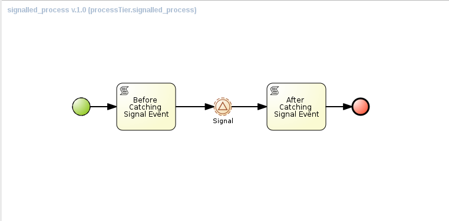

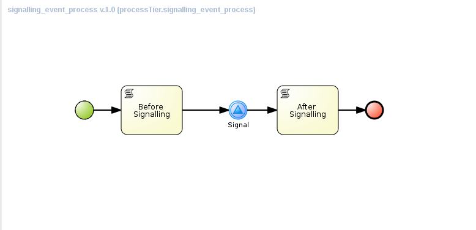

* `signalled_process` has a _catching intermediate signal_ event node, and when executed, will wait in that node until a suitable signal is catched.
* `signalling_event_process` has a _throwing intermediate signal_ event node, whose `signalRef` attribute corresponds to the the signal reference expected by `signalled_process`

There are several gotcha's using this approach:

* The throwing signal node takes only a signal reference as a parameter. There is no possibility to have a particular process instance id as a parameter. As a result, when the throwing signal triggers, *all* the process instances waiting for a signal with the same reference will be triggered.
* Signalling through a throwing signal event interferes with the Runtime strategy of the deployment unit. The catching of the event will happen in the same thread as the throwing, and in the same KieSession that manages the process instance that throws the event. +
As a result, signalling through throwing intermediate signal event will only work if the deployment unit uses _SINGLETON_ or _PER_REQUEST_ Runtime strategies, and will fail when using _PER_PROCESS_INSTANCE_. +
When using _PER_PROCESS_INSTANCE_, the process instances to be signalled cannot be loaded into the same KieSession as the process that throws the signal event, as they are already associated with another KieSession instance 

=== Signalling with an action script

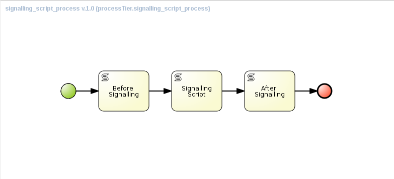

* `signalled_process` has a _catching intermediate signal_ event node, and when executed, will wait in that node until a suitable signal is catched.
* `signalling_script_process` has a _script_ node, with an implementation to signal a particular instance of `signalled_process`.
* `signalling_script_process` takes the process instance id and the signal reference of the process to signal as process variables.
* The implementation of the script node looks like:
+
----
        Long processInstanceId = new Long((String)kcontext.getVariable("processToSignal"));
        String signal = (String)kcontext.getVariable("signalType");
        String deploymentId =  (String)kcontext.getKieRuntime().getEnvironment().get("deploymentId");
        
        org.kie.api.runtime.manager.RuntimeManager rm = org.kie.internal.runtime.manager.RuntimeManagerRegistry.get().getManager(deploymentId);
        org.kie.api.runtime.manager.RuntimeEngine engine = rm.getRuntimeEngine(org.kie.internal.runtime.manager.context.ProcessInstanceIdContext.get(processInstanceId));
        org.kie.api.runtime.KieSession ksession = engine.getKieSession();
        ksession.signalEvent(signal, null, processInstanceId);
----

* To signal a process instance, we need to obtain a KieSession for this instance, taking into account the Runtime strategy of the deployment unit. +
The action script implementation does this by getting a reference to the RuntimeManager of the current deployment id. 
* Please note that we assume that both the signalling as the process to be signalled belong to the same deployment package, and as such share the same deployment id.

=== Signalling with a custom Work Item Handler

The solution using an action script has a number of drawbacks:

* script nodes are not reusable
* scripts are more difficult to maintain as they are 'buried' into the process definition

An alternative to a script node, is to use a task node, and associate that task node with a custom work item handler implementation. This task node can easily be reused in different process definitions.

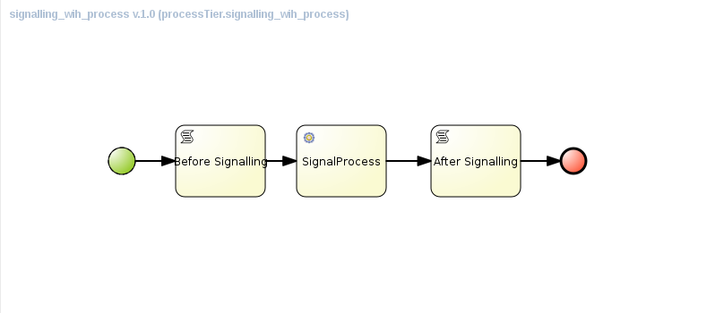

* The work item handler code is quite similar to the script code in the previous example. +
A custom work item handler needs to implement the `org.kie.api.runtime.process.WorkItemHandler` interface, more specifically the `executeWorkItem` method. +
The Work Item is terminated as part of the `executeWorkItem` method, which means that the task node will not act as a wait state. 
+
----
public class SignalProcessWorkItemHandler implements WorkItemHandler {

    @Override
    public void executeWorkItem(WorkItem workItem, WorkItemManager manager) {        
        
        String deploymentId = ((WorkItemImpl) workItem).getDeploymentId();
        RuntimeManager rm = RuntimeManagerRegistry.get().getManager(deploymentId);
        
        String signalType = (String)workItem.getParameter("signalType");
        Object event = workItem.getParameter("event");
        if (event == null) {
            event = Long.toString(workItem.getProcessInstanceId());
        }
        
        String processToSignal = (String)workItem.getParameter("processToSignal");
        RuntimeEngine engine = null;
        long processToSignalId = 0;
        if (processToSignal == null || processToSignal.isEmpty()) {
            engine = rm.getRuntimeEngine(EmptyContext.get());
        } else {
            processToSignalId = Long.valueOf(processToSignal);
            engine = rm.getRuntimeEngine(ProcessInstanceIdContext.get(processToSignalId));
        }

        KieSession ksession = engine.getKieSession();
        if (processToSignalId <= 0) {
            ksession.signalEvent(signalType, event); 
        } else {
            ksession.signalEvent(signalType, event, processToSignalId);
        }       
        
        manager.completeWorkItem(workItem.getId(), null);
    }
}
----

* The next step is to associate this work item handler to a specific task node, and make this task node available in the widget palette of the BPMS designer. +
This can be done by adding the following configuration to the WorkDefinitions configuration file of the project in BPMS
+
----
  [
    "name" : "SignalProcess",
    "parameters" : [
        "processToSignal" : new StringDataType(),
        "signalType" : new StringDataType()
    ],
    "displayName" : "SignalProcess",
    "icon" : "defaultservicenodeicon.png"
  ]
----
+
** this defines a new WorkItem type with the name `SignalProcess`. 
** We also define two parameters `processToSignal` - which takes the process instance id of the process to signal - and `signalType` - the signal reference. These correspond to the parameters used in our work item handler implementation.

* Our new 'SignalProcess' task is added to the BPMS designer palette, and can be added to process models:

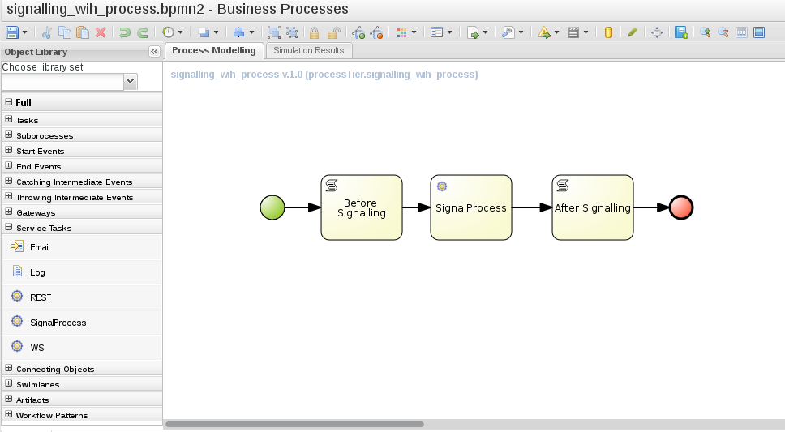

* Finally, we need to make the work item handler code available to the BPMS runtime. There are different ways to do so. The one we use for this reference architecture is to add the work item handler class to the project itself, and define the work item handler in the BPMS deployment descriptor (`kie-deployment-descriptor.xml`) of the project:
+
----
    <work-item-handlers>
        <work-item-handler>
            <resolver>mvel</resolver>
            <identifier>new com.redhat.gpe.refarch.bpms_process_signalling.wih.SignalProcessWorkItemHandler()</identifier>
            <parameters/>
            <name>SignalProcess</name>
        </work-item-handler>
        [...]
    </work-item-handlers>
----
+
This associates the `SignalProcessWorkItemHandler` implementation with task nodes of type `SignalProcess`

=== Asynchronous signalling with a custom Work Item Handler

Signalling with an action script or with a work item handler happens in a synchronous way: the process instance being signalled is executed until that process instance hits a wait state or terminates, before the signalling process instance is further executed. That is not necessarily a problem, but if the signalled process needs to execute a time-comsuming operation, the time before control returns to the signalling process might be unacceptable. This could be the case for example if the signalling is done after a user task is completed.

To get around this, we can signal in an asynchronous way.

The BPMS platform comes with a built-in executor component that offers quite advanced features for asynchronous execution.

The executor component operates on commands, which represents a piece of code that will be executed by the executor component as background job. The command implements `org.kie.internal.executor.api.Command`.

----
public interface Command {
    
    /**
     * Executed this command's logic.
     * @param ctx - contextual data given by the executor service
     * @return returns any results in case of successful execution
     * @throws Exception in case execution failed and shall be retried if possible
     */
    public ExecutionResults execute(CommandContext ctx) throws Exception;
}
---- 

Input data is transferred from the process engine to the command via the `CommandContext` object. The outcome of the execution is provided to the process engine via ExecutionResults

BPMS provides an out-of-the-box work item handler backed by the executor component. This handler is registered under the _async_ name in every KieSession created by BPMS. To use executor functionality in a process to execute some code in a asynchronous fashion, you add a task node to the process model with _async_ as task name, and you define a data input called `CommandClass` that takes the fully qualified name of the `Command` implementation class.

The command class used in this reference architecture looks like:

----
public class SignalProcessCommand implements Command {

    @Override
    public ExecutionResults execute(CommandContext ctx) throws Exception {
        RuntimeManager rm = null;
        RuntimeEngine engine = null;
        try {
            WorkItem workItem = (WorkItem) ctx.getData("workItem");
            String deploymentId = ((WorkItemImpl) workItem).getDeploymentId();
            rm = RuntimeManagerRegistry.get().getManager(deploymentId);
            
            String signalType = (String)workItem.getParameter("signalType");
            Object event = workItem.getParameter("event");
            if (event == null) {
                event = Long.toString(workItem.getProcessInstanceId());
            }
            
            String processToSignal = (String)workItem.getParameter("processToSignal");
            long processToSignalId = 0;
            if (processToSignal == null || processToSignal.isEmpty()) {
                engine = rm.getRuntimeEngine(EmptyContext.get());
            } else {
                processToSignalId = Long.valueOf(processToSignal);
                engine = rm.getRuntimeEngine(ProcessInstanceIdContext.get(processToSignalId));
            }

            KieSession ksession = engine.getKieSession();
            if (processToSignalId <= 0) {
                ksession.signalEvent(signalType, event); 
            } else {
                ksession.signalEvent(signalType, event, processToSignalId);
            }        
            return new ExecutionResults();
        } finally {
            if (rm != null) {
                rm.disposeRuntimeEngine(engine);
            }
        }
    }

}
----

The implementation is fairly similar to the synchronous work item handler example above. The WorkItem associated with the process node is passed through the predefined `workItem` context property. Also, we need to dispose of the runtime engine after executing the signal event method on the KieSession.

The implementation class is packaged into the kjar.

In the WorkDefinitions file of the project in BPMS we need to add the configuration for the asynch task node: 

----
  [
    "name" : "async",
    "parameters" : [
        "CommandClass" : new StringDataType()
    ],
    "displayName" : "async",
    "icon" : "defaultservicenodeicon.png"
  ]
----

In the process model, an _asynch_ task is added to the process model. 

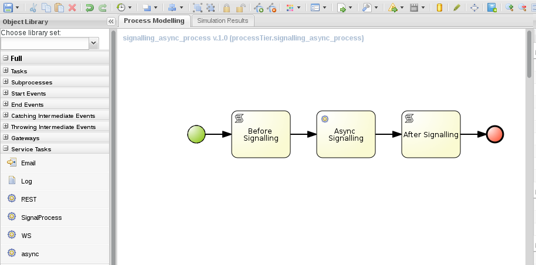

Task data inputs are defined for the fully qualified name of the command class (`CommandClass`), and for the `processToSignal` and `signalType` properties.

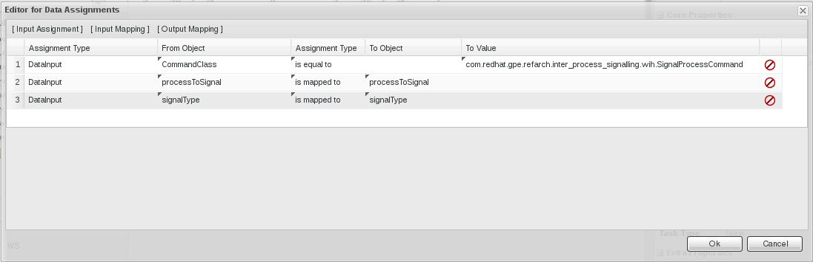

=== Starting a process instance with a _throwing intermediate signal_ event

A particular form of signalling between processes is using a signal to start a process instance. A start node of a process model can be associated with several event types, which define the trigger that will instantiate a process instance is instantiated. A process with a _signal start event_ type will be triggered by a signal broadcasted from a another process, or from through the BPMS Remote APIs. If such a signal is captured and the signal type corresponds to the signal type of the process, a instance of that process will be initiated. Note that multiple processes can have a Signal Start Event that will be triggered form the same broadcasted signal.

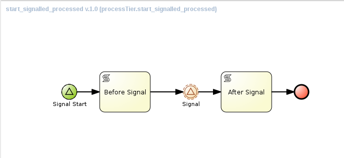

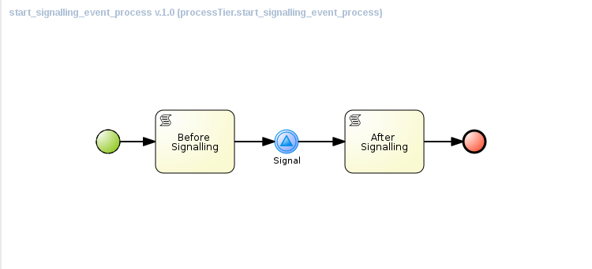

* `start_signalled_process` has a _signal start event_ start node. An instance of the process will be instantiated when a signal with the corresponding signal type is broadcasted by another process or a BPMS API call.
* `start_signalling_event_process` has a _thowing intermediate signal_ event node, whose `signalRef` attribute corresponds to the the signal reference expected by `start_signalled_process`.
* a signal event has a type (the signal reference) and a value. The value of the event can be used to pass data between the signalling process and the signalled process. +
In this example we set the process instance id of the signalling process as the event value, and attribute this to a process variable of the process instance started by the signal. +
The event value is set using data input associations. In this example we map the process instance variable `processInstanceId` to the signal input data object with named `SignalInput`. +
The process instance id is obtained from the process instance context set in the script node preceding the signal node.
+
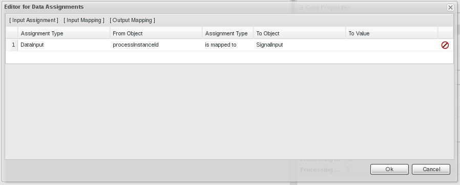
+
On the process catching the signal, the signal value is mapped to a process instance variable with a data output association.
+
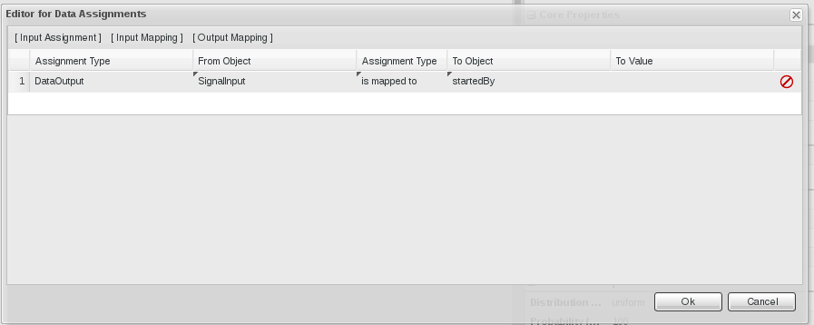 

=== Starting a process instance asynchronously with a custom Work Item Handler

Just as with the signalling examples above, starting a process instance with a signal happens in a synchronous way. So here as well, we can leverage the BPMS built-in executor to have the process started asynchronously.

In fact, we can reuse the same `SignalProcessCommand` implementation as in the signalling example, if we don't pass a process instance id to the work item handler.

== Prerequisites
. Proficiency with basic *nix command line
. Familiarity with {bpmproduct}
. (Optional) Docker container images for BPMS - e.g. https://github.com/jboss-gpe-ose/docker-images/tree/master/bpmsuite

== Provision BPM Suite 6.1 Application

[NOTE]
The Red hat Partner Demo System is currently using BPMS version 6.0.3. + 
However, several of the examples and techniques outlined in this reference architecture do not work correctly on this version of BPMS, due to various issues that have been fixed in BPMS 6.1. +
Hence we will assume a local installation of BPMS 6.1. +
Alternatively, you can run BPMS in a docker container. 

Refer to {bpms_installation} for instructions on how to install BPMS 6.1.

== Config And Deployment

=== BPM Suite 6: Clone this reference architecture

This reference architecture includes a KIE project called: _processTier_ .
The _processTier_ project includes several BPMN2 process definitions that show-case signalling between processes in BPMS.

Use the following steps to clone this reference architecture in BPM Suite 6:

. Log into the `BPM Console`  web application of BPM Suite 6
+
The userId to use is:  `jboss`  and the password to use is:  `brms`

. navigate to:  Authoring -> Administration.
. Select `Organizational Units` -> `Manage Organizational Units`
. Under `Organizational Unit Manager`, select the `Add` button
. Enter a name of _gpe_ and an owner of _jboss_. Click `OK`
. Clone this bpms_process_signalling repository in BPM Suite 6
.. Select `Repositories` -> `Clone Repository` .
.. Populate the _Clone Repository_ box as follows and then click _Clone_ :

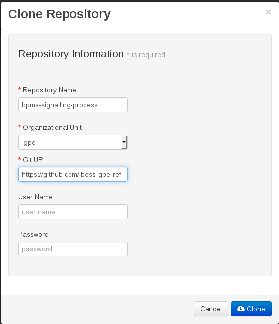

Enter _bpms-process-signalling_ as the value of the _repository name_.
The value of _Git URL_ is the URL to this reference architecture in github:

-----
https://github.com/jboss-gpe-ref-archs/bpms_process_signalling.git
-----

Once successfully cloned, BPM Suite 6 will pop-up a new dialog box with the message:  _The repository is cloned successfully_

== Execution and Testing

=== Signalling with a _throwing intermediate signal_ event

The `signalling_event_process` and `signalled_process` processes can be used to test out signalling with _throwing intermediate signal_ events. The `signalled_process` process definition has a _catching intermediate signal_ node with signal reference 'signal1'. When an instance of this process is started, it will halt execution in this node, waiting for a suitable signal. The `signalling_event_process` process has a _throwing intermediate signal_ node, with signal reference 'signal1'. So if an instance of this process instance is executed, we would expect instances of _signalled_process_ to be signalled and resume execution.

==== SINGLETON runtime strategy

* Build and deploy the _processTier_ project
. In the BPMS console, navigate to `Authoring -> Project Authoring`
. In the `Project Explorer` panel, ensure that `gpe -> bpms-process-signalling -> processTier` is selected
+
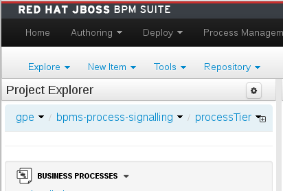
+
. Navigate to `Authoring -> Project Authoring -> Tools -> Project Editor`.
. In the `Project Editor` panel, click `Build and Deploy`.
. Verify deployment:
.. `Deploy -> Deployments`
+
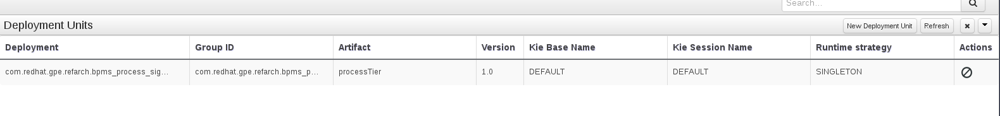
+
.. Verify the depoyment strategy, which should be set to _SINGLETON_, which is the default in BPMS.

* Start one or more instances of `signalled_process`:
. In the `BPM Console`, navigate to `Process Management -> Process Definitions`.
. Select the _Start_ icon of the `signalled_process` process definition.
. An empty form appears. Click the _Play_ button on the bottom of the form to start an instance of the process.
. Verify that an instance of the `signalled_process` exists in the `Process Management -> Process Definitions` view.
+
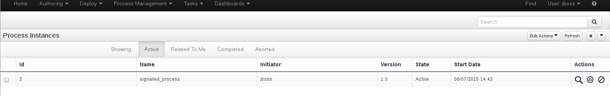
+
. Repeat the previous steps to create another instance of `signalled_process`.

* Start an instance of `signalling_event_process`:
. Go back to `Process Management -> Process Definitions`, and start an instance of `signalling_event_process`.

* In the application logs, we see the following output:
+
----
09:29:26,339 INFO  [stdout] (http-/172.17.0.9:8080-1) Process 'processTier.signalled_process' with id '1' waiting for signal
09:29:35,240 INFO  [stdout] (http-/172.17.0.9:8080-1) Process 'processTier.signalled_process' with id '2' waiting for signal
09:29:49,872 INFO  [stdout] (http-/172.17.0.9:8080-1) Process 'processTier.signalling_event_process' with id '3' before signalling
09:29:49,937 INFO  [stdout] (http-/172.17.0.9:8080-1) Process 'processTier.signalled_process' with id '1' signalled
09:29:49,985 INFO  [stdout] (http-/172.17.0.9:8080-1) Process 'processTier.signalled_process' with id '2' signalled
09:29:50,003 INFO  [stdout] (http-/172.17.0.9:8080-1) Process 'processTier.signalling_event_process' with id '3' after signalling
----
+ 
This indicates that our instances of `signalled_process` have been correctly signalled. + 
Note that: 
+
** Both instances of `signalled_process` have been signalled - with a _throwing intermediate signal_ event it is not possible to target a particular process instance for signalling.
** Signalling of the process instances happens synchronously.

==== PER_REQUEST runtime strategy

* To deploy the _processTier_ project using PER_INSTANCE strategy, we need to deploy the project manually.
. Undeploy the project: in `Deploy -> Deployments`, remove the current deployment of the _processTier_ project by clicking on the _Abort_ button next to it.
.. If the undeployment fails, it is probably because there are still process instances active for the current deployment.
.. Navigate to `Process Management -> Process Instances` and abort all running process instances, by clicking on the _Abort_ button. Alternatively, select the process instances to abort and click `Bulk Actions -> Bulk Abort`.
.. Go back to `Deploy -> Deployments` and undeploy the _processTier_ project.
. In `Deploy -> Deployments`, click the `+` button.
. In the `Deploy a New Unit` dialog box, fill in the values for the _processTier_ project:
** Group ID : com.redhat.gpe.refarch.bpms_process_signalling
** Artifact : processTier
** Version : 1.0
** Runtime Strategy : Request
** Kie Base Name : leave blank
** Kie Session Name : leave blank
** Merge mode : Merge collections
. Click the `Deploy Unit` button.
. In `Deploy -> Deployments`, verify that the project deployed sucessfully and that the Runtime strategy has the value `PER_INSTANCE`. 
+
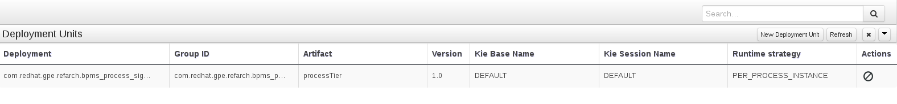

* Repeat the steps in the previous chapter to test process signalling using a _throwing intermediate signal_ event. 
* We obtain the same results as with SINGLETON runtime strategy.

==== PER_INSTANCE runtime strategy

* Repeat the steps above, but this time use the PER_INSTANCE runtime strategy - choose `Process instance` as Runtime strategy in the deployment dialog box.
* This time, observe that the `signalled_process` instances waiting on a signal do not get signalled:
+
----
09:47:25,736 INFO  [stdout] (http-/172.17.0.9:8080-1) Process 'processTier.signalled_process' with id '7' waiting for signal
09:47:29,302 INFO  [stdout] (http-/172.17.0.9:8080-1) Process 'processTier.signalled_process' with id '8' waiting for signal
09:47:46,418 INFO  [stdout] (http-/172.17.0.9:8080-1) Process 'processTier.signalling_event_process' with id '9' before signalling
09:47:46,428 INFO  [stdout] (http-/172.17.0.9:8080-1) Process 'processTier.signalling_event_process' with id '9' after signalling
----
+
* The reason is that the signal event interferes with the session management in BPMS: the signal is executed in the context of the KieSession of the signalling process. However, the process instances of the processes to be signalled are associated with a different KieSession, and cannot be loaded in the current KieSession.

==== Conclusion

Using a _throwing intermediate signal_ is not really suited as a technique for signalling processes from within another process. It does not work with PER_INSTANCE runtime strategy. Also, with a _throwing intermediate signal_ it is not possible to target a particular process instance with the signal: all process instances waiting on a particular signal type will be signalled.

=== Signalling with an action script

The `signalling_script_process` and `signalled_process` processes can be used to test out signalling with an action script. 

==== SINGLETON runtime strategy

* Build and deploy the _processTier_ process as dscribed above.
* Start an instance of `signalled_process`. Take note of the process instance id of the newly started process instance. This can be found in the `Process Management -> Process Instances` view. Start another instance of `signalled_process`.
* Start an instance of `signalling_script_process`.
* In the start process form, fill in the following values:
** processToSignal : process instance id of the `signalled_process` instance.
** signalType : signal1
* Press the _Play_ button
* In the logs, you'll see something like:
+
----
09:52:13,891 INFO  [stdout] (http-/172.17.0.9:8080-1) Process 'processTier.signalled_process' with id '10' waiting for signal
09:52:18,135 INFO  [stdout] (http-/172.17.0.9:8080-1) Process 'processTier.signalled_process' with id '11' waiting for signal
09:52:35,030 INFO  [stdout] (http-/172.17.0.9:8080-1) Process 'processTier.signalling_script_process' with id '12' before signalling
09:52:35,037 INFO  [stdout] (http-/172.17.0.9:8080-1) Process 'processTier.signalled_process' with id '10' signalled
09:52:35,055 INFO  [stdout] (http-/172.17.0.9:8080-1) Process 'processTier.signalling_script_process' with id '12' after signalling
----
+
This indicates that our instance of `signalled_process` has been correctly signalled. Only the process instance corresponding with the id passed to `signalling_script_process` has been signalled.

==== PER_REQUEST and PER_INSTANCE runtime strategies

* Repeat the same steps for PER_REQUEST and PER_INSTANCE runtime strategies.
* Observe in the logs that the `signalled_process` instances are correctly signalled.

=== Signalling with a custom work item handler

The `signalling_wih_process` and `signalled_process` processes can be used to test out signalling with an action script. 

* Follow the same steps as above, but use `signalling_wih_process` to signal process instances. 
* Observe in the logs that the `signalled_process` instances are correctly signalled.
* Repeat the test with different runtime strategies.

=== Asynchronous signalling with a custom work item handler

The `signalling_async_process` process uses the BPMS built-in executor component and a `org.kie.internal.executor.api.Command` implementation to signal process instances asynchronously.

* Follow the same steps as above, but use `signalling_async_process` to signal process instances.
* In the logs, you will see something like:
+
----
10:12:26,630 INFO  [stdout] (http-/172.17.0.9:8080-4) Process 'processTier.signalled_process' with id '17' waiting for signal
10:12:46,882 INFO  [stdout] (http-/172.17.0.9:8080-4) Process 'processTier.signalling_async_process' with id '18' before signalling
10:12:49,883 INFO  [stdout] (EJB default - 9) Process 'processTier.signalled_process' with id '17' signalled
10:12:49,984 INFO  [stdout] (EJB default - 9) Process 'processTier.signalling_async_process' with id '18' after signalling
----
+
* Signalling happens asynchronously, in a different thread than the one used to start the instance of `signalling_async_process`. Note however that as with synchronous processing, the execution of `signalled_process` is resumed before nodes in `signalling_async_process` after the signal node are executed.
* Repeat the test with different runtime strategies.

=== Starting a process instance with a _throwing intermediate signal_ event

The `start_signalled_process` process has a _signal start event_ start node. An instance of this process will be instantiated if a signal with the appropriate signal type is broadcasted by another process.

* Start an instance of `start_signalling_event_process`.
+
In the start process form, leave the `processInstanceId` field blank. The value of this process variable will be set in the action script node following the start node. Its value will be set to the process instance id of the process. +
When the signal is broadcasted, the value of the `processInstanceId` will be passed to the signal, and mapped to a process instance variable of the process instance by this signal.
* In `Process management -> Process Instances` verify that we now have a new running instance of `start_signalled_process`.
* In the log, you will see something like:
+
----
10:28:15,744 INFO  [stdout] (http-/172.17.0.9:8080-6) Process 'processTier.start_signalling_event_process' with id '19' before signalling
10:28:15,757 INFO  [stdout] (http-/172.17.0.9:8080-6) Process 'processTier.start_signalled_processed' with id '20' started by signal from process '19'
10:28:15,757 INFO  [stdout] (http-/172.17.0.9:8080-6) Waiting on signal
10:28:15,762 INFO  [stdout] (http-/172.17.0.9:8080-6) Process 'processTier.start_signalling_event_process' with id '19' after signalling
----
+
* Note that when using a _throwing intermediate signal_ event to signal, the signal type is part of the signal definition and as such hard coded into the process definition. 

=== Starting a process instance asynchronously with a custom Work Item Handler

A process can also be started asynchronously by using the `signalling_async_process` to broadcast a signal, but this time without passing a process instance id. 

* Start an instance of `signalling_async_process`.
+
In the start process form, leave the `processInstanceId` field blank. For `signalType`, use the value _SignalStart_.
* In `Process management -> Process Instances` verify that we now have a new running instance of `start_signalled_process`.
* In the log, you will see something like:
+
----
10:38:03,102 INFO  [stdout] (http-/172.17.0.9:8080-5) Process 'processTier.signalling_async_process' with id '21' before signalling
10:38:05,368 INFO  [stdout] (EJB default - 10) Process 'processTier.start_signalled_processed' with id '22' started by signal from process '21'
10:38:05,369 INFO  [stdout] (EJB default - 10) Waiting on signal
10:38:05,439 INFO  [stdout] (EJB default - 10) Process 'processTier.signalling_async_process' with id '21' after signalling
----

