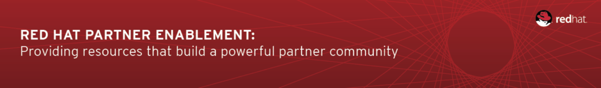

:data-uri:
:toc2:
:rhtlink: link:https://www.redhat.com[Red Hat]
:bpmproduct: link:https://access.redhat.com/site/documentation/en-US/Red_Hat_JBoss_BPM_Suite/[Red Hat's BPM Suite 6 product]
:dockerbpms: link:https://github.com/jboss-gpe-ose/docker_bpms/blob/master/doc/userguide.adoc[docker_bpms]

:numbered!:
[abstract]
== BPMN2 Sub Processes

:numbered:

== Overview

== Pre-Requisites

. ssh client
. maven 3.0.5 (or greater)
. git client
. curl
. familiarity with {bpmproduct}
. proficiency with basic *nix command line
. docker
. either the mysql or postgresql variant of the {dockerbpms} image

== Set-up

=== local: Build the Reference Architecture

